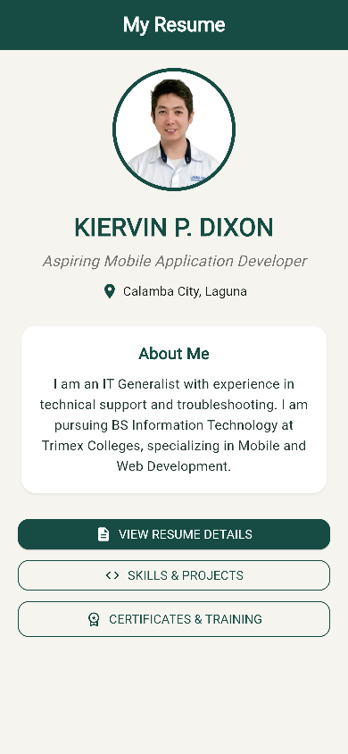
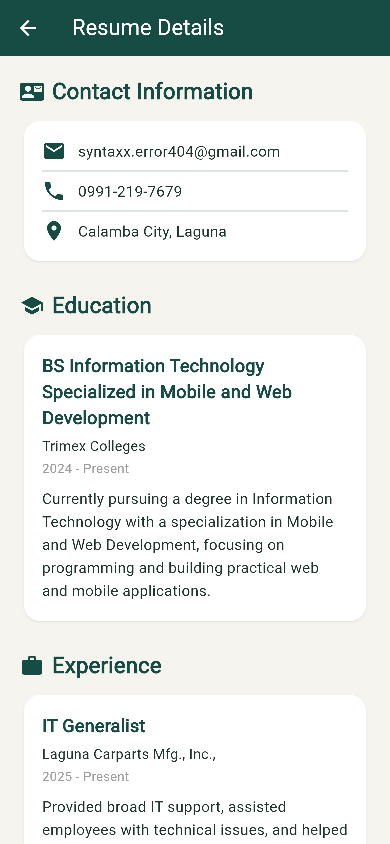
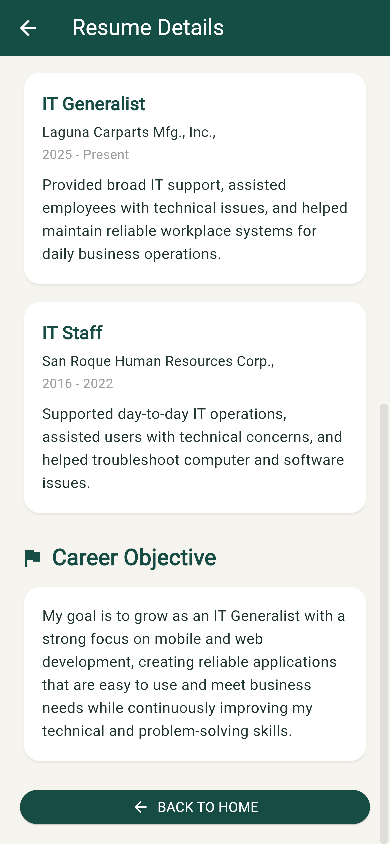
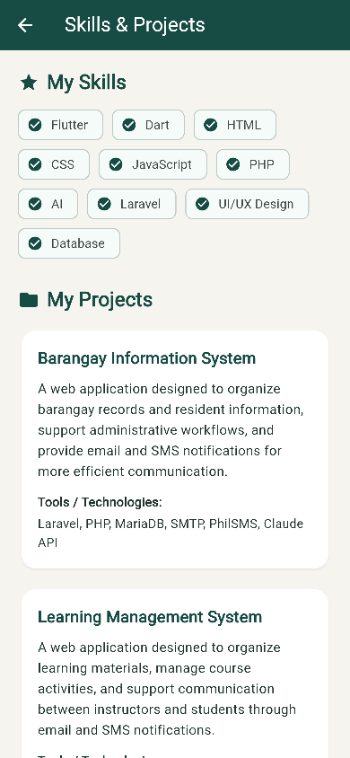
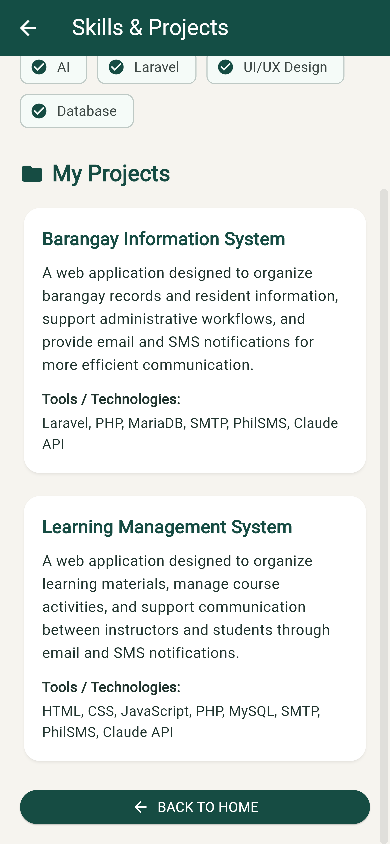
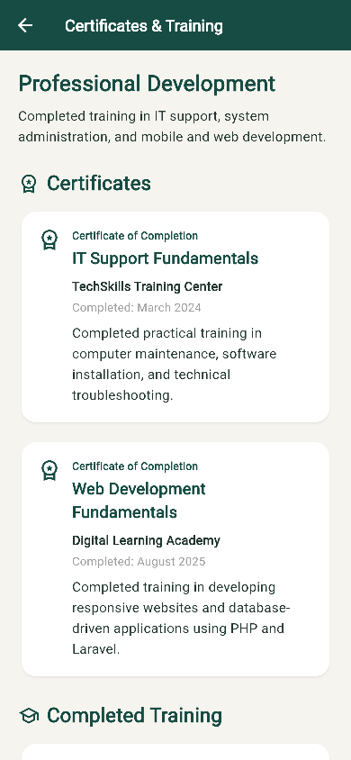
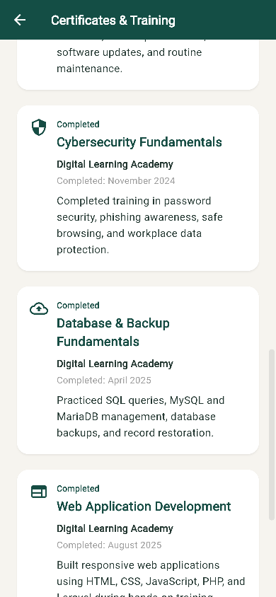
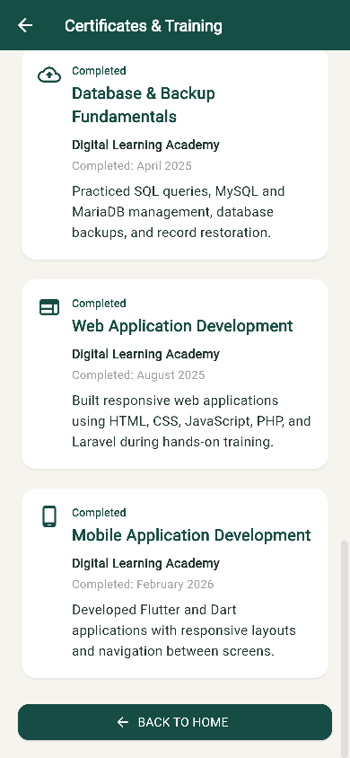

# Consistent card styles

White cards, 16 px corners, a subtle shadow, matching padding, and dark teal headings across all four screens. iPhone viewport: 390 x 844.

## Home

## Resume Details

## Experience

## Career Objective

## Skills & Projects

## Barangay Information System

## Learning Management System

## Certificates & Training

## Completed Training

## Mobile Application Development

