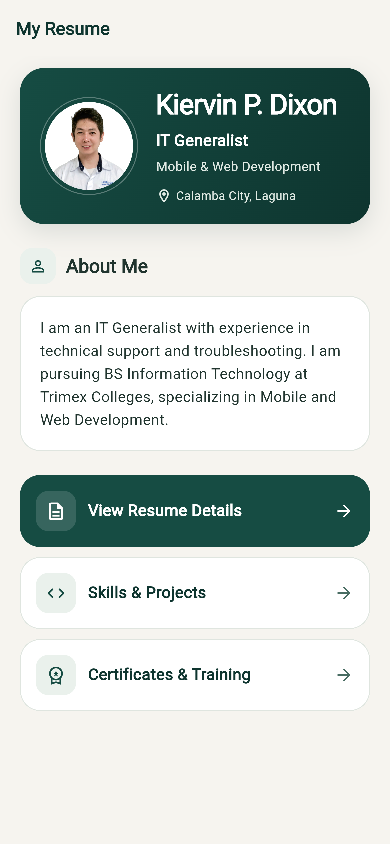
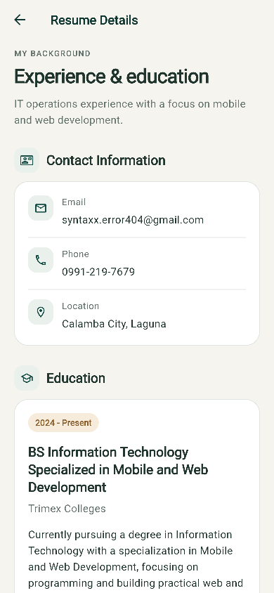
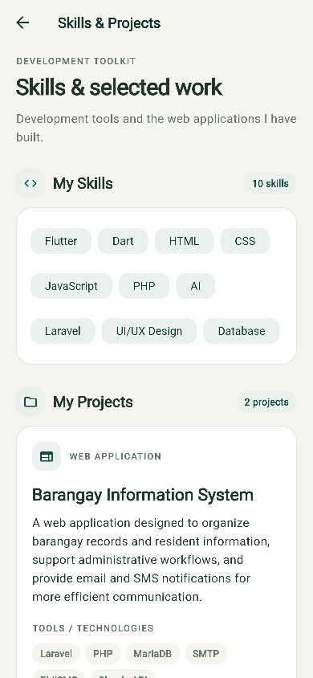
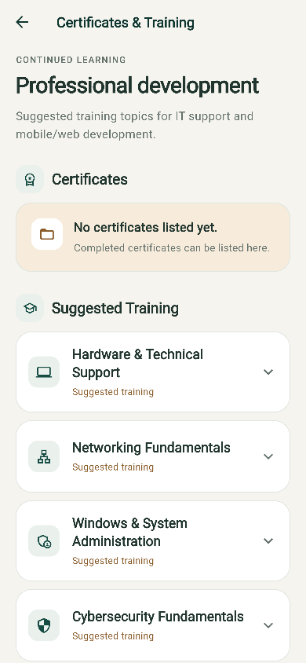

**Resume UI redesign**

Dark teal, warm neutral surfaces, soft borders, readable typography, and consistent spacing across all four screens.

The profile now highlights IT Generalist and Mobile & Web Development. Navigation uses full-width cards with clear labels and arrows. Resume dates and project technologies use compact badges. Project cards use two columns on wider screens and one column on phones or with larger text. Suggested training details expand on demand.

Verification: Flutter analysis passed; four widget tests passed; all 50 browser checks passed across 320 × 568, 390 × 844, 393 × 851, 844 × 390, and 1024 × 768 layouts. The previously observed Flutter debug web startup ViewInsets assertion is recorded in the raw browser logs; no new browser exceptions or visible layout overflow were found.

| Screen | Preview | More content |
| --- | --- | --- |
| Home / Profile | [Home](home.png) | [Small phone](small-phone-home.png) |
| Resume Details | [Top](resume-details.png) | [Bottom](resume-details-bottom.png) |
| Skills & Projects | [Top](skills-projects.png) | [Bottom](skills-projects-bottom.png) · [Tablet](tablet-projects.png) |
| Certificates & Training | [Top](certificates-training.png) | [Expanded topic](training-expanded.png) · [Bottom](training-bottom.png) |

**Home / Profile**

**Resume Details**

**Skills & Projects**

**Certificates & Training**

